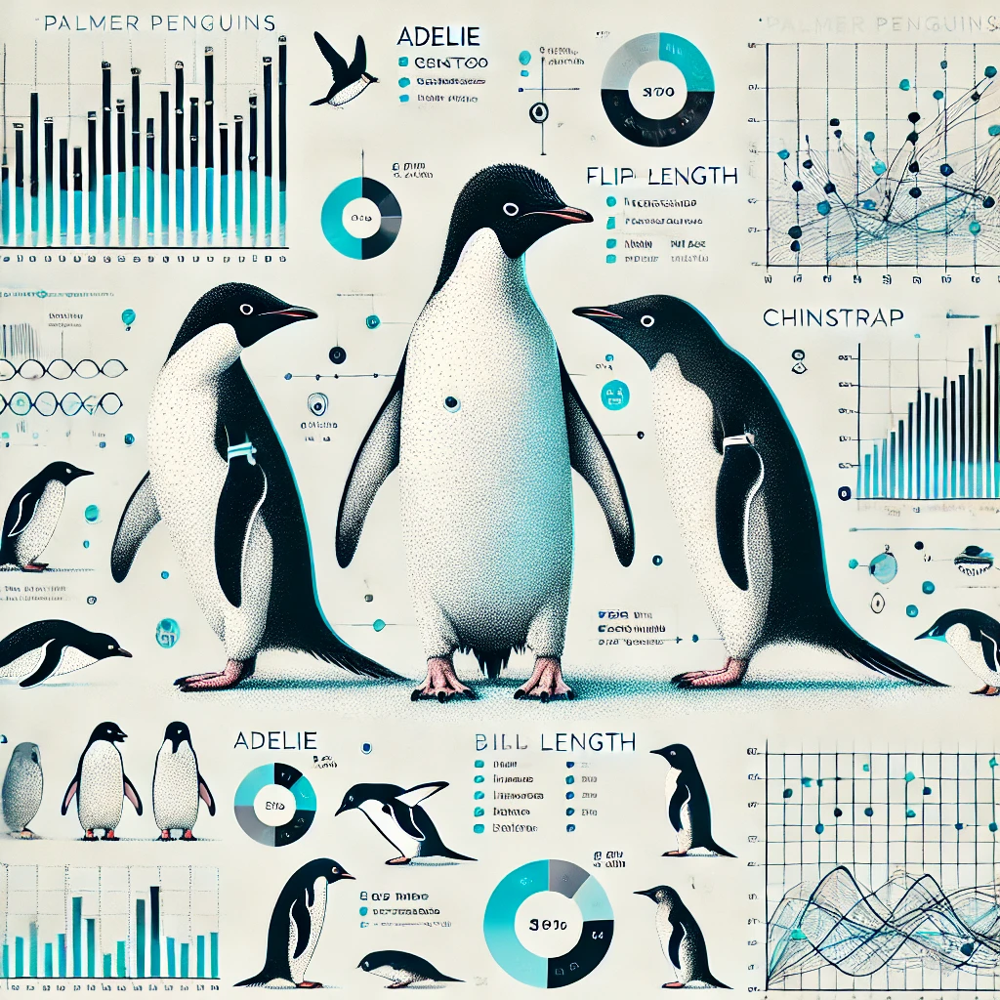

## <Projeto tem como objetivo fornecer um ótimo conjunto de dados para exploração e visualização de dados, como uma alternativa ao iris.>

## Descrição do Projeto

Este projeto tem como objetivo explorar e analisar um conjunto de dados que contém características físicas de três espécies de pinguins da região de Palmer, Antártica. Ele busca fornecer insights sobre as diferenças entre essas espécies, além de ser uma alternativa divertida e didática ao famoso conjunto de dados de íris de Fisher, amplamente utilizado em estudos de machine learning.

## Justificativa

O conjunto de dados "Palmer Penguins" oferece uma excelente oportunidade para a prática de análise de dados, machine learning e visualização de dados de uma maneira divertida e acessível. Este projeto foi escolhido por sua simplicidade e riqueza de variáveis, permitindo a aplicação de técnicas variadas de análise exploratória de dados e algoritmos de aprendizado supervisionado. Além disso, este conjunto de dados é frequentemente utilizado como exemplo em cursos e tutoriais de data science por sua clareza e simplicidade.

## Metodologia

O projeto será desenvolvido utilizando a metodolgia CRISP-DM, seguindo os seguintes passos:

1- Entendimento de Negócio
2- Entendimento de Dados

